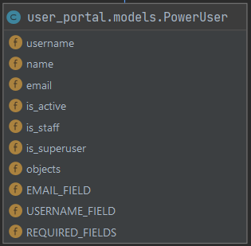
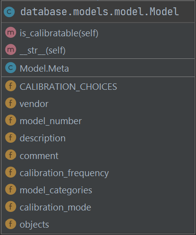
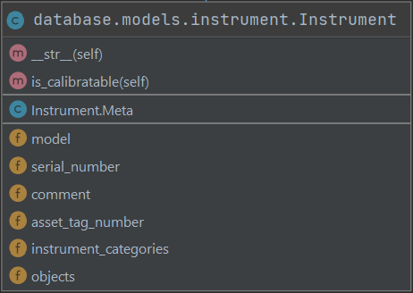
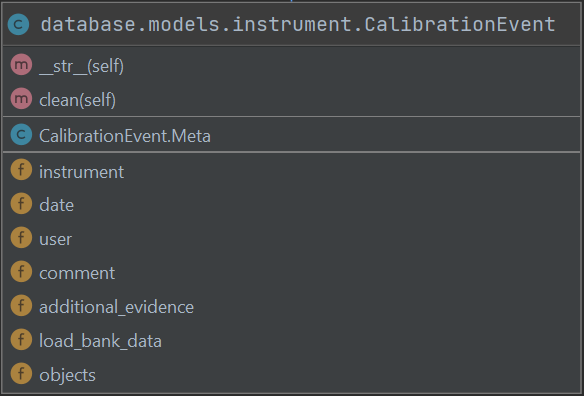

# Developer Guide

## Overview

This project employs a thick, client-side React front end on top of a remote Django REST Framework backend. The front end and backend are both managed by different GitHub repositories, which autodeploy on push to two different VM test servers, each of which can then be pushed to two different production servers.

The React front end contains the logic for structuring the layout and flow of visual components, handling their internal functions and interactions, and defining the user experience. It also creates remote requests to the back end, processing responses in ways they can be combined with others and presented.

The Django REST Framework processes front end requests made 
to access the inventory, handling validation, sorting, and other business logic. The front end is constructed using HTML templates, which 
behave as a structural skeleton that frames logic-handling views. 

The database app contains all the inventory-related models and the REST API. The other apps handle the structure and logic of the interface:
front_lp handles various functions like logging in and creating models, detail_views handles pages for individual models and instruments, 
and page_views handle the table views of models and instruments, along with the bulk or the functional dashboards.

# Front End (React)

## Frontend Technologies

### React

The front end is built using React.js, a modern Javascript/HTML hybrid framework. React applies object oriented methodologies to web design, allowing you to treat individual components on a screen as instances of stateful classes, which can be recycled and extended with ease. This strays from traditional HTML design, where granularity lies mostly at the page level.

React uses the markup layout logic of HTML, adding its own custom elements and allowing you to create your own. Components use JavaScript to describe internal logic and behavior, and can access external JavaScript utilities and fetches.

### MDBootstrap/Boostrap

Because of the highly recyclable, customizable nature of React, many libraries exist which contain advanced, prestyled components and css classes. One of these libraries is MDBootstrap. 

#### We used MDBoostrap for the following components:

* DataTables
    * These DataTables, while powerful, are often very limited in extensibility after a certain point. For instance, they contain no support for backend pagination, so for tables accessing large databases, the table functions all needed to be reproduced and overrided 
    * These customizations can be found the shared library under Common
- Inputs
- Buttons
- Headers 

Scattered, far less organized libraries than MDBootstrap exist across the internet for various separate functions, all following the Bootsrap design framework.

#### We found and used Bootstrap implementations for:

- Day Pickers
- Typeaheads (for autocomplete)
- Multiple Typaheads (for categories)
- Stepper (for the load bank wizard)

### JavaScript Fetch API

Requests to the backend were made using the JavaScript Fetch API. The Fetch API takes in the url, headers, body, and other settings, then performs inputted actions on the responses based on successes or failures. 

### Node.js/Npm

The project runs using Node.js, and project dependencies are managed by yarn and npm. Yarn can be installed by running 

   ```shell
   sudo npm install --global yarn
   ```

If you want to add a library to the project, you just run 

    yarn add <library>

When you pull from the repository, just run ```yarn```, and everything in your package.json will be installed into a working set of dependencies called node_modules.

## <a name="Front"></a> Frontend Workspace

The frontend is designed to maximize recyclability and modularity, and so contains multiple subdirectories divided extensively into subdirectories, with a directory 
for shared elements.

To set up your workspace:

1) Fork the repo at https://github.com/ECE458FiveGuys/FiveGuysFront
2) Install the most recents stable version of Node.js (14.16.0)
3) Run npm-install to install all the dependencies from the package.json
4) Run npm-start to run an instance of the server, allowing you to update in real time

Now, to the specifics of the project.

The main project modules are: 


#### App.js:

App.js is not a directory, but a file at the root of the project containing the layout of all routes, as well as the logic mapping initial properties to each top level page component. It also carries logic determining which routes are authorized and not authorized.

When you make a page, add your route here and give it the properties it needs to start out.

Below, you can see the home "/" route being tied to a page, giving it some base properties.

                  <Route exact path="/"
                    render={(props) => <MainView history={props.history}
                                                 location={props.location}
                                                 token={this.state.token}
                                                 user={this.state.user}/>}>
There are 2 routes.

* One handles authorization (logging in) and maps to the "auth" folder                                                 
* The other contains the actual application, mapping to the other modules

This line determines what route you're on:

    if (!this.state.token || !this.state.user)


### Auth:

The auth directory contains everything on the auth route:

* Login screen, with token access logic
* Oauth screen, which handles Oauth acccess, redirect, and token retrieval

### App:

"App" is the second route, containing all the following main submodules.

## Pages:

When someone makes a page, they add the directory containing everything for that page as a subdirectory in this module. Pages should contain a main Component which the router links to, containing mostly just overall layout logic. Subcomponents will populate the subdirectories in each page module.

#### The pages in the project are:

MainPage: 
* Contains a tabbable table of instruments and models, with the ability to search, export, or create entries. 
* Each row in the table is selectable and links to a detail view corresponding to that instrument/model

DetailPages:
* Contains the logic for the detail pages for instruments and models, including calibration recording for instruments

CategoryPage:
* A page with an tabbable, editable table of model and instrument categories

UsersPage:
* A page with an actionable table of users, allowing you to deactivate, create, and change permissions

UserSettingsPage:
* A page allowing you to customize your settings
* Now, just supports password change

LoadBankPage:
* A module for all the logic for the load bank wizzard

ImportPage:
* A module for a page walking users through the instrument/model import process

KlufeWizardPage:
* A module containing the .js file for the Klufe guided harware calibration page as well as components and functions used in the calibrator.


## Controller

The controller contains a library of Fetch API based methods for handling requests to the backend. 

The shared libraries are: 

* ModelRequests
* InstrumentRequests
* UserRequests
* CategoryRequests
* ImportExportRequests
* KlufeRequests
* LoginRequests
* Calibration Requests

There is also a RequestUtils folder which is used by all the Request modules; namely all request functions use the same universal fetch method.

Thiere is also a URLs file, containing hostnames and all the backend URLS. Reference this when making an addition to the Request library.

To talk to the database, you just have to do:

    FooRequests.Foo(token, callBack, errorCallBack, fooParam1, fooParam2...)
    
These methods are designed to be backend-blind, so the user never has to think about urls.

## Utils

A folder of shared, functional tools and enums. 

Enums:
* The enums file is one of the most essential elements here, containing constant references to JSON keys used for fields from backend requests. This allows people to all maintain the same references, smoothing bugs with mistyping and allowing for IDE autocomplete.


## Common

Perhaps the most useful module for a new developer in the system, Common contains abstracted building blocks, which can be used to create new pages and maintain consistent thematics and style. 

The most useful of these are:

* DataTable
    * Sortable, navigable client-side table
* BackendPaginatedDataTable
    * Instance of DataTable with sorting and navigation overwritten to call backend functions
* EditableTable
    * A table in which entries can be selected and modified
* NavBar
    * The main header at the top of the page
* HTPStepper
    * A stylized, highly customizable stepper with advanced options. Can be used within other steppers 
* FormEntry
    * For processing forms
* FormModal
    * For forms mounted on a popup
* HTPPopup
    * For error handling
* HTPInput
* HTPButton

When you complete a page or component, see what you can abstract out and place in this folder so others can use.

# Back End (RESTful Django)

## Backend Technologies

### SQLite

We use SQLite as our database. It is the default database for Django and is stored on the same server as the backend.

### Django

Django is our backend framework. Here, we define all of the interactions with the database.

### Django REST framework

We use the Django REST framework (DRF) to build the backend interface.

### Djoser

Djoser is used to deal with user authorization. We use token-based authentication.

## How Technologies Interact

Django is used to make the models and provide a high-level interface to the SQLite database. Most field-level validation is done at the model level. Then, DRF is used to create the endpoints as well as serialize and de-serialize the data. The frontend interacts with endpoints generated by the DRF and the DRF in turn communicates with Django. Finally, Djoser acts as a Django/DRF hybrid in the sense that it used for the user model as well as user endpoints.

## How Backend is Constructed

At a high level, the backend is made up of three main parts: models, serializers, and views.

### Models
The models describe the database schema. A large amount of the validation is done in the models. An important part of the models are Manager classes, which are used to add table-level functionality to models. 

### Serializers
Serializers take deserialize JSON data from the views into model objects, handing it off for the model layer to interact with the database. They also take models from model layer and serialize them into JSON data for the views to hand back to the client.

### Views
Views determine the ways in which a client may interact with the backend. The word "view" is a bit of a misnomer, as there isn't much to see, it's merely an endpoint that accepts certain actions and data and hands back data in a specified format. Interacts with the client and with the serializers.

### Extra
Lastly, there are a few extra components to tie everything up. We have a urls file that provides information about how endpoints are routed to certain views and there is a settings file to specify server-wide conditions.

## Configuration

### Backend Workspace

The project is stored in two repositories, one for frontend and one for backend. The frontend repo is [FiveGuysFront](https://github.com/ECE458FiveGuys/FiveGuysFront) while the backend repo is [FiveGuysPowerTesting](https://github.com/ECE458FiveGuys/FiveGuysPowerTesting). The frontend repo is configured to talk to the development backend server located at <https://group-six-react.colab.duke.edu/>. Thus, to get started on working with the frontend, all one has to do is clone the frontend repo, run a few commands to build the project, and you should already have a backend up and running to interact with. The instructions for this can be found in the [Frontend Workspace section](#Front). As for the backend, to get started one would clone the repo, install requirements, create the database, and then run a local server. Below are the instructions for doing so.

```shell
$ git clone git@github.com:ECE458FiveGuys/FiveGuysPowerTesting.git
$ cd FiveGuysPowerTesting
$ python3 -m venv env
$ source env/bin/activate           # may differ based on OS
$ pip install -r requirements.txt
$ python manage.py makemigrations database
$ python manage.py makemigrations user_portal
$ python manage.py migrate
$ python manage.py createsuperuser  # create your first user
$ python manage.py collectstatic    # for DRF web interface
$ python manage.py runserver
```

Running all of the above commands, in order, one-by-one, will result in a functioning dev environment. The easiest way to interact with the API would be to either use the command line or [Postman](https://www.postman.com/).

### Production Environment

See the Deployment Guide.

## Database Schema

### Users

User authorization is done using the Djoser library. The code can be found in the `user_portal` directory. Here, we have the model `PowerUser` that inherits from `Abstract User`. It has a manager `PowerUserManager` that defines the several functions, the most important of shich is `PowerUser.objects.create()`. When creating a superuser, the fields `is_staff` and `is_superuser` are both set `True`. When creating a normal administrator, the field `is_staff` is set to `True`. Otherwise, they are `False`. When creating a standard user, the only fields that are required are `username`, `name`, `email`, and `password`. The field `is_active` is not required but is set to `True` if no value is given. 



### Models

Models are handled by the `Model` class. In the database, each `Model` object has several fields: `vendor, model_number, description, comment, instruments, calibration_frequency, calibration_mode, and model_categories`. The model has a uniqueness constraint where `vendor` and `model_number` must form a unique pair. The `instruments` field is a `ForeignKey` in the `Instrument` Model and holds a list of all instruments of that model. Note that one cannot delete a model that has any instruments linked to it. The `model_categories` field is a `ManyToManyField` field. Deleting a model will not delete its categories or vice versa.


### Instruments

Instruments are handled by the `Instrument` class. In the database, each `Instrument` object has several fields: `model, serial_number, asset_tag_number, comment, calibration_history, and instrument_categories`. The model has a uniqueness constraint where `model` and `serial_number` must form a unique pair. Note that `serial_number` may be null. The `calibration_history` field is a `ForeignKey` in the `CalibrationEvent` Model and holds a list of all calibration events of that instrument. It should be noted that depending on the query, you might either get a list of the calibration events or a single field `most_recent_calibration_date` indicating the date of the most recent `CalibrationEvent` object associated with that instrument. Also of note, there is another annotation (not stored in the database) called `calibration_expiration_date` that is calculated as `model__calibration_date` + `most_recent_calibration_date`. Lastly, the`instrument_categories` field is a `ManyToManyField` field. Deleting an instrument will not delete its categories or vice versa.


### Calibration Events

Calibration Events are handled by the `CalibrationEvent` class. In the database, each `CalibrationEvent` object has several fields: `instrument, date, user, comment, additional_evidence, and load_bank_data`. The model does not have any uniqueness constraint. The `instrument` field and the`user` field are both `ForeignKey` objects. It should be noted that it is not possible to create a calibration event for a model that is not calibratable. Furthermore, there is a restriction that only a model whose `calibration_mode` is `LOAD_BANK` may have any data in the `load_bank_data` field.



### Categories
Has a name field. Name can be include most characters but may not have whitespace.

# Server Technologies

### Gunicorn

Gunicorn is a Python WSGI HTTP Server for UNIX. Moderately popular. Used for backend.

### nginx

nginx is a webserver. Used for both frontend and backend.
