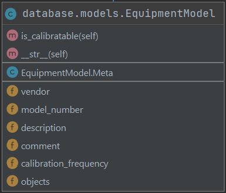

# Developer Guide

## Overview

## Technologies

### SQLITE

We use SQLITE as our database. It is the default database for Django and is stored on the same server as the project.

### Django

We use Django for both the frontend and backend. 

### Django REST framework

We use the Django REST framework to communicate between the frontend and backend. We made a conscious, if not regrettable, decision to completely separate the frontend and backend and have them communicate using REST API calls. The one good thing about this decision is that it allows us to change our frontend without any changes to the backend if we wish.

### Djoser

Djoser is used to deal with user authorization. Since we are using Django frontend and backend, we could have used Django sessions, but Djoser allows for the frontend to be changed without any modifications to backend.

### Gunicorn

Gunicorn is a Python WSGI HTTP Server for UNIX. Moderately popular. Used on dev and prod servers.

### nginx

nginx is a webserver. Easier to configure than apache in the humble opinion of the dev ops guy.

## Configuration

## Database Schema

### Users

User authorization is done using the Djoser library. The code can be found in `user_portal`. Here, we have the model `PowerUser` that inherits from `Abstract User`. It has a manager `PowerUserManager` that defines the `PowerUser.objects.create()` function. When creating a superuser, the fields `is_staff` and `is_superuser` are both set `True`. Otherwise, they are `False`. When creating a standard user, the only fields that are required are `username`, `name`, `email`, and `password`. The field `is_active` is not required but is set to `True` if no value is given. 

### Models

Models are handled by the `EquipmentModel` class. Originally named `Model`, we changed it because Django has a lot of references to another Model class. In the database, each `EquipmentModel` object has 4 fields: `vendor, model_number, description, comment, instruments`. The model has a uniqueness constraint where `vendor` and `model_number` must form a unique pair. The `instruments` field is a `ForeignKey` in the `Instrument` Model and holds a list of all instruments of that model. Note that one cannot delete a model that has any instruments linked to it.

### Instruments

Instruments are handled by the `Instrument` class. In the database, each `Instrument` object has 4 fields: `model, serial_number, comment, calibration_history`. The model has a uniqueness constraint where `model` and `serial_number` must form a unique pair. The `instruments` field is a `ForeignKey` in the `CalibrationEvent` Model and holds a list of all calibration events of that instrument. It should be noted that depending on the query, you might either get a list of the calibration events or a single field `most_recent_calibration_date` indicating the date of the most recent `CalibrationEvent` object associated with that instrument. Also of note, there is another annotation (not stored in the database) called `calibration_expiration_date` that is calculated as `model__calibration_date` + `most_recent_calibration_date`. 

### Calibration Events

Calibration Events are handled by the `CalibrationEvent` class. In the database, each `CalibrationEvent` object has 4 fields: `instrument, date, user, comment`. The model does not have any uniqueness constraint. The `instrument` field and the`user` field are both `ForeignKey` objects. It should be noted that it is not possible to create a calibration event for a model that is not calibratable.

